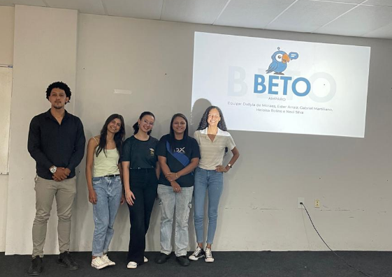
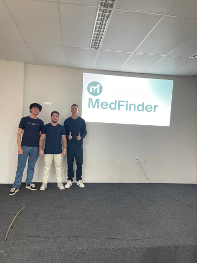
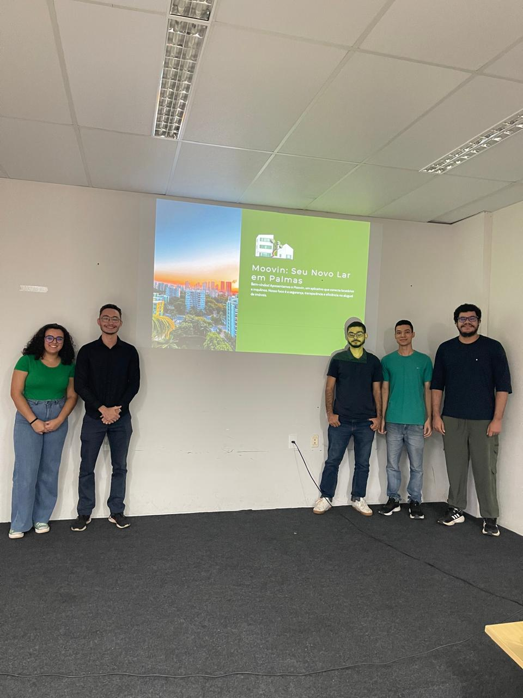

# Projeto de Sistemas 2025/1 | Universidade Federal do Tocantins - Palmas
**Curso:** Bacharelado em Ciência da Computação  
**Professor:** Edeilson Milhomem da Silva  
**Período:** 2025/1

---

## Índice
- [Projeto de Sistemas 2025/1 | Universidade Federal do Tocantins - Palmas](#projeto-de-sistemas-20251--universidade-federal-do-tocantins---palmas)
  - [Índice](#índice)
  - [Sobre a Disciplina](#sobre-a-disciplina)
  -[Evento](#evento)
  -[StartupSE](#startupse)
    -[Logo](#logo)
      -[Fotos Do Evento](#fotos-do-evento)
        -[Fotos da Banca](#foto-da-banca)
        -[Foto da Turma](#foto-da-turma)
      -[Notícias sobre o evento](#notícias-sobre-o-evento)
        -[Postagem no site oficial da UFT](#notícias-sobre-o-evento)
- [Grupos](#grupos)
  - [Grupo 1 - DexBazaar](#grupo---1)
  - [Grupo 2 - HortaShop](#grupo-2---hortashop)
  - [Grupo 3 - TrazAí](#grupo-3---trazaí)
  - [Grupo 4 - Beto Amparo](#grupo-4---beto-amparo)
  - [Grupo 5 - MedFinder](#grupo-5---medfinder)
  - [Grupo 6 - Moovin](#grupo-6---moovin)

---

## Sobre a Disciplina
Disciplina prática de Projeto de Sistemas com foco no desenvolvimento de soluções tecnológicas inovadoras, aplicando metodologias ágeis e boas práticas de engenharia de software.

---
## Evento

### Instituições
- **Agência de Inovação da Universidade Federal do Tocantins (Inovato)**
- **SEBRAE Tocantins**
- **Incubadora de Empresas da Universidade Federal do Tocantins**

### Representantes
(Preencha aqui)

## StartupSE

### Logo

## Fotos do Evento
### Foto da banca

#### Integrantes da banca

📌Gelma Carvalho - Gestora de Educação Empreendedora

📌Walbenia Lemos é Analista de Negócios 

📌Edglei Rodrigues - Coordenador de Comércio, Serviço e Sustentabilidade

### Foto da Turma

### Notícias sobre o evento
[Site da UFT](https://www.uft.edu.br/noticias/alunos-apresentam-projetos-de-sistemas-com-solucoes-para-problemas-do-cotidiano)

# Grupos
## Grupo 1 - DexBazaar

### Descrição do Produto

O dexBazaar é um marketplace descentralizado para compra e venda de produtos físicos com pagamento em criptomoedas.
Principais características:

- 🛒 Marketplace para qualquer categoria de produto, aberto para vendedores e compradores
- 💸 Pagamento seguro via criptomoedas, com sistema de multisig e escrow
- 🔒 Foco em privacidade e descentralização das transações
- 🛠️ Ferramentas para gestão de anúncios, carteiras e recebíveis

### Integrantes
| Nome                          | GitHub                                      |
|-------------------------------|---------------------------------------------|
| Yuri Barbosa Takahashi        | [@calloc2](https://github.com/calloc2) |
| Emanuel Badaró Fonseca        | [@AlunEmanuel](https://github.com/AlunEmanuel)    |
| Vitor Leal                    | [@squidleeal](https://github.com/squidleeal) |

### Repositório
🔗 [Acesse nosso repositório no GitHub](https://github.com/calloc2/dexbazaar)

---

### Documentação Técnica
- [Figma](https://www.figma.com/design/SjKudZhomZkMQfJH6S9mYG/ProjetoDeSistemas?node-id=0-1&p=f)
- [Canvas e MVP](https://docs.google.com/document/d/1_lcApBw3zV5uPu6YecKle387iv3_uuYzAaiRIxjvHJc/edit?usp=sharing)
- [Apresentação Pitch](https://www.canva.com/design/DAGsa04lf6Y/1aGEstjFL9FaFAfcnpMwnA/edit)
- [Apresentação Técnica](https://www.canva.com/design/DAGpNtKES6o/F1KtPM-Q2osikYO8UJ30Qg/edit?utm_content=DAGpNtKES6o&utm_campaign=designshare&utm_medium=link2&utm_source=sharebutton)

## Grupo 2 - HortaShop

### Descrição do Produto

O HortaShop é uma plataforma online inovadora que:
- 🔗 Conecta consumidores diretamente a produtores rurais da Agricultura Familiar
- 🥦 Oferece alimentos frescos e saudáveis de Palmas-TO
- 🌱 Promove sustentabilidade e economia regional
- 🚚 Reduz impacto ambiental através de cadeias de distribuição curtas
- 💰 Elimina intermediários para melhor remuneração dos produtores

### Integrantes
| Nome                          | GitHub                                      |
|-------------------------------|---------------------------------------------|
| Antonio André Barcelos Chagas | [@andrebarceloschagas](https://github.com/andrebarceloschagas) |
| Helorrayne Cristine           | [@HeloCris](https://github.com/HeloCris)    |
| Gustavo Gonzaga dos Santos    | [@uGonzaguinha](https://github.com/uGonzaguinha) |
| Raphael Sales                 | [@raphaelsales](https://github.com/raphaelsales) |
| Thiago Gonzaga dos Santos     | [@thiagogonzagadev](https://github.com/thiagogonzagadev) |

### Repositório
🔗 [Acesse nosso repositório no GitHub](https://github.com/HortaShop-PS)

---

### Documentação Técnica
- [Requisitos do Sistema](https://github.com/HortaShop-PS/.github/blob/main/user_stories.md)
- [Roadmap](https://github.com/HortaShop-PS/.github/blob/main/planejamento_entregas.md)  

 

### Grupo 3 - TrazAí
 O TrazAí é uma plataforma web e mobile que
conecta clientes e mercados, permitindo
compras simples, entregando diretamente
na sua casa, com rapidez e segurança.

## Tecnologias Utilizadas

- Linguagens Utilizadas:

  

- Frameworks:

  

- Banco de Dados:

  

- Ferramentas:

  
  
  
  

## Integrantes do Projeto:

| Nome                               | GitHub                                                       |
|----------------------------------- |------------------------------------------------------------- |
| Arthur Lima Duarte                 | [Arthutstuts96](https://github.com/Arthutstuts96)            |
| Gabriel Fernades Zamora            | [GFernandesZ](https://github.com/GFernandesZ)                |
| Jessé Eliseu Nunes da Silvaa       | [jessilver](https://github.com/jessilver)                    |
| Jonatas de Sousa Madeira           | [MellloJ](https://github.com/MellloJ)                        |
| João Pedro Ribeiro Dias Moraes           | [CaesarCrew](https://github.com/CaesarCrew)                        |

## Repositório:
| Links Uteis                                                                                |
|------------------------------------------------------------------------------------------- |
| [TrazAí (Web) - Ir ao Repositório](https://github.com/MellloJ/Projeto-de-Sistemas.git)     |
| [TrazAí (App Mobile) - Ir ao Repositório](https://github.com/Arthutstuts96/Projeto-de-Sistemas-mobile.git)     |

### Documentação Técnica 

| Item                               | Link                                                       |
|----------------------------------- |------------------------------------------------------------- |
| Landing Page                 | [Landing Page](https://jessilver.github.io/trazai-landing-page/)            |
| Apresentação Final            | [Pitch](./TrazAí/apresentacao-final.pptx)                |
| Apresentação Técnica       | [Apresentação Técnica](./TrazAí/apresentacao-tecnica.pdf)                    |
| Model Canvas           | [Model Canvas](./TrazAí/Model-Canvas-Projeto-De-Sistemas.pdf)                    |
| Download do APK           | [APK](https://github.com/)                        |

## Grupo 4 - Beto Amparo  

### Descrição do Produto  
O **Beto Amparo** é um sistema híbrido de atendimento humanizado que combina o **WhatsApp Business** com uma **plataforma web**, oferecendo uma experiência integrada e acessível para clientes e donos de negócio. Ele:

- 🤝 Facilita a comunicação inicial via WhatsApp com respostas automáticas  
- 📲 Redireciona clientes para o site com links personalizados  
- 🧾 Possui formulário de pedidos e agendamentos diretamente no site  
- 📊 Disponibiliza um dashboard para o dono do negócio visualizar demandas  
- 🧪 Desenvolvido como um MVP com base em user stories reais  
- 🌐 Desenvolvido com Next.js + Supabase  
- 📱 Funciona como PWA (Progressive Web App), podendo ser instalado no celular  

### Acesso ao Sistema  
- 📲 **Landing Page e vídeo comercial**: [https://beto-amparo.vercel.app/](https://beto-amparo.vercel.app/)  
- 📥 **APK (instalação via PWA)**: Acesse o mesmo link acima no celular e adicione à tela inicial para instalar como app.

> ⚠️ O link da **landing page** e o de instalação do **APK/PWA** é o mesmo:  
> 👉 [https://beto-amparo.vercel.app/](https://beto-amparo.vercel.app/)

### Dia da apresentação do pitch

### Integrantes  
| Nome                        | GitHub |
|-----------------------------|--------|
| Gabriel Martiliano          | [@gabrielbdsm](https://github.com/gabrielbdsm) |
| Ester Arraiz de Matos       | [@esterarraiz](https://github.com/esterarraiz) |
| Neci Oneides da Silva       | [@gallineci](https://github.com/gallineci) |
| Heloisa Rolins Ribeiro      | [@h-rolins](https://github.com/h-rolins) |
| Dallyla de Moraes Sousa     | [@dallylademoraes](https://github.com/dallylademoraes) |

### Repositório  
🔗 [Acesse nosso repositório no GitHub](https://github.com/dallylademoraes/beto-amparo)

### Documentação Técnica  
- 🧪 MVP e User Stories no `README.md` do repositório
- [Apresentação Técnica](BetoAmparo/apresentações/apresentação-tecnica.pdf)
- [Apresentação do Pitch](BetoAmparo/apresentações/pitch%20-%20beto%20amparo.pdf)
  
## Grupo 5 - MedFinder

### Descrição do Produto

**MedFinder** é uma plataforma digital inovadora que:  
- 🏥 **Conecta pacientes a clínicas e profissionais de saúde** conforme convênios e especialidades  
- 📍 **Facilita o agendamento online** de consultas e exames  
- 📲 **Amplia a visibilidade** de médicos, dentistas, psicólogos e outros profissionais da saúde  
- ⏱️ **Reduz o tempo de espera e otimiza o atendimento médico**  
- 💼 **Fomenta parcerias** com clínicas, laboratórios e convênios, impulsionando o acesso à saúde privada  

### 👥 Integrantes

| Nome                              | GitHub                                                  |
|-----------------------------------|----------------------------------------------------------|
| Henrique Noronha Fernandes        | [@henrique-noronha](https://github.com/henrique-noronha) |
| Vicente Alves Gregório Netto      | [@Vicentolah17](https://github.com/Vicentolah17)         |
| João Victor Mota                 | [@JaumMota](https://github.com/JaumMota)                 |

### Repositório
🔗 [Acesse nosso repositório no GitHub](https://github.com/henrique-noronha/medfinder)  

### Documentação Técnica  
[Landing Page](https://henrique-noronha.github.io/medfinder/)   
[Pitch](./MedFinder/Pitch%20MedFinder.pptx)  
[Apresentação Técnica](./MedFinder/ApresentaçãoTecnicaMedFinder.pptx)  
[APK](https://github.com/henrique-noronha/medfinder/releases/download/1.3.1/MedFinder.apk)  
[Vídeo de Apresentação](https://www.youtube.com/watch?v=r8xK5ktD7xw)  

### Foto do Grupo  

## Grupo 6 - Moovin

### Descrição do Produto

Moovin visa conectar locatários e inquilinos, proporcionando um ambiente seguro para a busca, anúncio e gerenciamento de imóveis para aluguel. Além disso, oferecerá funcionalidades adicionais para facilitar a administração dos contratos e aprimorar a experiência do usuário. O compromisso com a segurança se reflete na verificação de perfis e autenticação de usuários, a transparência será promovida por meio de avaliações e relatórios detalhados, e a eficiência será garantida com filtros avançados, notificações inteligentes e comunicação ágil. 

### Integrantes
| Nome                        | GitHub                                           |
|----------------------------|---------------------------------------------      |
| Victhor Cabral Magalhães   | [@VicthorCM](https://github.com/VicthorCM)        |
| João Vitor Reis Dias       | [@joaovitro99l](https://github.com/joaovitro99)   |
| Ana Júlia Campos Vieira    | [@Ana4Julia](https://github.com/Ana4Julia)        |
| Mayconn Cardoso Soares     | [@Mayconncs](https://github.com/Mayconncs)        |
| Pedro Lucas Moreira Pinto  | [@Swampertian](https://github.com/Swampertian)    |

### Foto da Equipe
  

### Repositório
🔗 [Acesse nosso repositório no GitHub](https://github.com/Swampertian/Moovin)

### Artefatos 
- [MVP](https://1drv.ms/w/c/db855c096b910a16/EeK9tC0tvWFNhQesX0arOKsBRbiTnK-u8hcvCZ89QzSkdQ?e=ykXWZc)  
- [Escopo do Projeto](https://1drv.ms/w/c/db855c096b910a16/Efdnnu3xRWROhgAldwqg83EBn4tgXcp-WBmLTZD-wsa-Sw?e=g2WNaL)
- [Vídeo Comercial](https://github.com/EquipeMoovin/Moovin/blob/main/docs/V%C3%ADdeoComercialMoovin.mp4) 
- [APK final](https://github.com/EquipeMoovin/Moovin/blob/main/Backend/static/apks/moovin.apk)
- [Landing Page](https://moovin.onrender.com/)
- [Última Release - 1.4.0](https://github.com/Swampertian/Moovin/releases/tag/1.4.0)
- [Apresentações](https://github.com/EquipeMoovin/Moovin/tree/main/docs/apresenta%C3%A7%C3%B5es)

---
